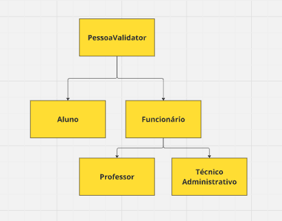

# Sistema-Gerenciamento-Escola

Este projeto é um sistema em Java que permite o gerenciamento de dados de alunos, funcionários técnico-administrativos e professores de uma escola. O sistema foi desenvolvido utilizando Programação Orientada a Objetos (POO) e inclui funcionalidades de cadastro, edição, consulta e exclusão, além de controle de acesso com autenticação.

## 📋 Funcionalidades Principais

### 1. Controle de Acesso
- O sistema exibe uma janela de login no início da execução.
- O usuário deve fornecer seu nome completo.
- Uma senha é gerada automaticamente usando o primeiro nome em maiúsculas seguido do dia, mês e ano atuais.
  - Exemplo: Nome: Fulano de Tal → Senha: FULANO762023
- Se o usuário errar a senha, pode tentar novamente ou encerrar o programa.

---

### 2. Gerenciamento de Membros
O sistema gerencia os seguintes tipos de membros da escola:
- **Aluno**
  - Nome, CPF, Data de nascimento, Telefone, sexo
  - RA (Registro Acadêmico)
  - IRA (Índice de Rendimento Acadêmico)

- **Funcionário Técnico-Administrativo**
  - Nome, CPF, Data de nascimento, Telefone, sexo
  - Código funcional
  - Departamento

- **Professor**
  - Nome, CPF, Data de nascimento, Telefone, sexo
  - Código funcional
  - Área de atuação (Matemática, Física, Linguagens, etc.)

#### Funcionalidades disponíveis:
- **Cadastro**: Cadastro de novos membros com validação de CPF.
- **Edição**: Permite a edição dos dados, com validação de CPF ao alterar.
- **Consulta**: Mostra todos os dados cadastrados e a idade atual.
- **Exclusão**: Remove um membro do banco de dados.

## 🛠️ Tecnologias Utilizadas

- **Linguagem:** Java
- **Interface Gráfica:** Swing
- **Banco de Dados:** MySQL
- **Conexão com Banco:** JDBC
- **Validação:** Classe externa para validação de CPF
- **Controle de Versão:** Git

---
## 📦 Esquema de Herança das classes




## 📦 Estrutura do Projeto

```plaintext
/src
 ├── bean
 │   ├── Aluno.java                        # Classe derivada para Aluno
 │   ├── Funcionario.java                  # Classe base abstrata para funcionários
 │   ├── TecnicoAdministrativo.java        # Classe para técnicos administrativos
 │   ├── Professor.java                    # Classe para professores
 │   ├── PessoaValidator.java              # Classe com validação de CPF
 │   └── CpfInvalidoException.java         # Exceção personalizada para CPF inválido
 ├── dao
 │   ├── AlunoDAO.java                     # Operações de banco para Aluno
 │   ├── FuncionarioDAO.java               # Operações de banco para Técnicos Administrativos
 │   └── ProfessorDAO.java                 # Operações de banco para Professores
 ├── conexao
 │   └── BancoDados.java                   # Classe para conexão com banco de dados
 └── gui
     ├── JFrameAluno.java                  # Interface gráfica para gerenciar alunos
     ├── JFrameFuncionario.java            # Interface gráfica para gerenciar técnicos administrativos
     ├── JFrameProfessor.java              # Interface gráfica para gerenciar professores
     ├── JFrameOpcoes.java                 # Interface gráfica para gerenciar opções de entidades
     └── JFrameLogin.java                  # Interface gráfica para login


